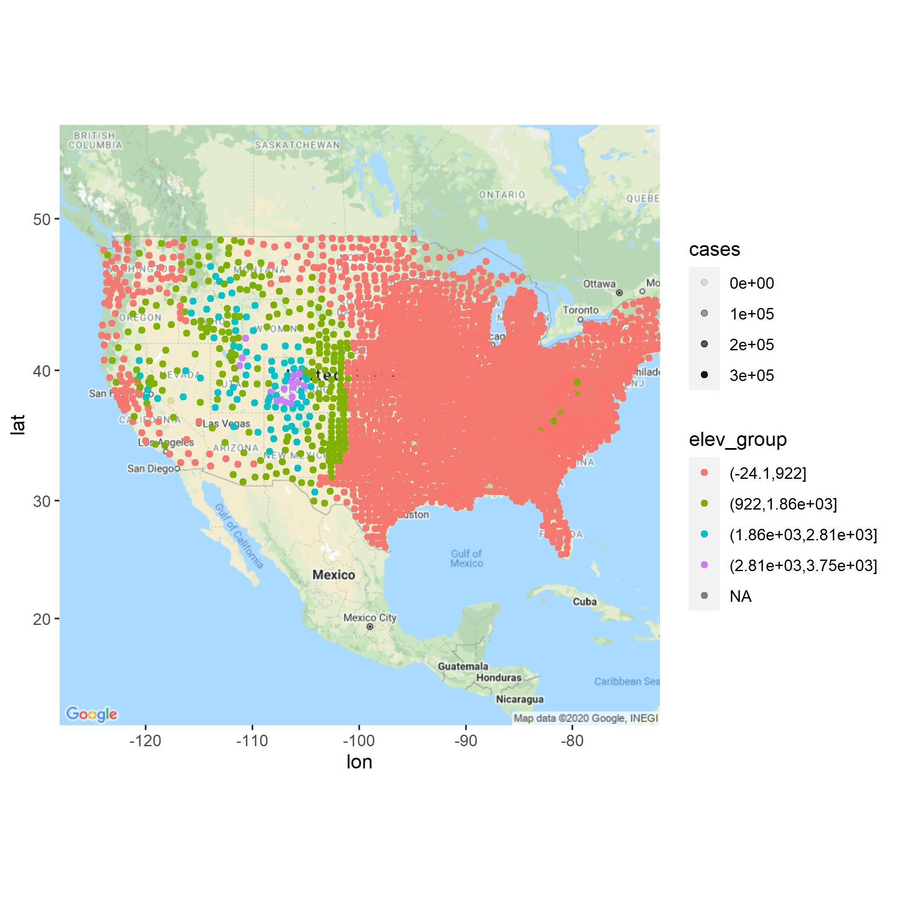

```{r setup, include=FALSE}
knitr::opts_chunk$set(echo = TRUE)
```


## Covid-19 Report <br/>
### Taking a look at elevations.
This report contains an analysis of Covid-19 data from Janruary 21st 2020 to November 24, 2020
throughout much of the United States; the data was provided by New York Times. <br/>

First I decided to make a plot of elevation to get a good idea of how US counties are laid out.
They are shown here divided into four different elevation groups measured in meters.

```{r message=FALSE, warning=FALSE, include=FALSE, paged.print=FALSE}
library(tidyverse)
library(gganimate)
library(magick)
library(jpeg)
  
#Loading in stuff.
death_animation <- image_read(path = "./Output/covid_deaths_progression.gif")
cases_animation <- image_read(path = "./Output/covid_progression.gif")

deaths_model <- readRDS("./Output/deaths_model_summary.RDS")
cases_model <- readRDS("./Output/cases_model_summary.RDS")

prophet_cases <- readRDS("./Output/patched_cases.RDS")
prophet_deaths <- readRDS("./Output/patched_deaths.RDS")

lac <- readRDS("./Output/low_alt_cases_plot.JPG")
mac <- readRDS("./Output/moderate_alt_cases_plot.JPG")
hac <- readRDS("./Output/high_alt_cases_plot.JPG")
eac <- readRDS("./Output/extreme_alt_cases_plot.JPG")

lad <- readRDS("./Output/low_alt_deaths_plot.JPG")
mad <- readRDS("./Output/moderate_alt_deaths_plot.JPG")
had <- readRDS("./Output/high_alt_deaths_plot.JPG")
ead <- readRDS("./Output/extreme_alt_deaths_plot.JPG")

```
As may have been expected, the western half has the most elevated counties due to tectonics, though there are a few elevated counties in the Appalachians. <br/>

### Case Rates
The plots shown below represent the reported case rates for US residents of varying altitudes as presented
by prophet model predictions. Each of the plots is represented in the order of and inclusive of the height brackets below.
Variable "y" represents cases and variable "ds" represents dates. (patchwork plots would not display properly) <br/>
Height: (-24.1m -> 922m]
```{r message=FALSE, warning=FALSE, paged.print=FALSE, echo=FALSE}
lac
```

Height:(922m -> 1860m]
```{r message=FALSE, warning=FALSE, paged.print=FALSE, echo=FALSE}
mac
```

Height:(1860m -> 2810m]
```{r message=FALSE, warning=FALSE, paged.print=FALSE, echo=FALSE}
hac
```

Height:(2810m -> 3750m]
```{r message=FALSE, warning=FALSE, paged.print=FALSE, echo=FALSE}
eac
```

### Death Rates
The plots shown below are also output from prophet, except "y" shows death rates. The death plots do not appear
to have the same shape as the case plots. <br/>

Height: (-24.1m -> 922m]
```{r message=FALSE, warning=FALSE, paged.print=FALSE, echo=FALSE}
lad
```

Height:(922m -> 1860m]
```{r message=FALSE, warning=FALSE, paged.print=FALSE, echo=FALSE}
mad

```

Height:(1860m -> 2810m]
```{r message=FALSE, warning=FALSE, paged.print=FALSE, echo=FALSE}
had
```

Height:(2810m -> 3750m]
```{r message=FALSE, warning=FALSE, paged.print=FALSE, echo=FALSE}
ead
```

### Cases by county over time

These first quadruplet of plots show that there are far more cases at low altitudes simply because more people live there.
That is to be expected, so what may be more useful is an animation of case severity over time; this is achieved by dividing cases by population as shown below. Severity is indicated by ascending the color scale.

```{r message=FALSE, warning=FALSE, paged.print=FALSE, echo=FALSE}
cases_animation
```

### Deaths by county over time

The quadruplet plots of deaths over time suffer the same population distribution problems, so here is another animated
plot displaying the severity of deaths over time per population. Severity is portrayed by the color scale.

```{r message=FALSE, warning=FALSE, paged.print=FALSE, echo=FALSE}
death_animation
```

### Consider

These graphs indicated what may be another lurking variable. The areas where black folks live is also coincidentally
lower elevation and they are known to suffer worse from the virus. This is something to take into consideration...

### Modeling

Now to model the severity of deaths and cases. The models used are shown below.
Once again deaths and cases are divided by population to eliminate a lurking variable.
Each is shown as a function of date and elevation.

```{r message=FALSE, warning=FALSE, paged.print=FALSE,eval=FALSE}
mod1 <- glm(covid_data,family=gaussian(),
            formula = sqrt(deaths/population) ~ date + elevation) #DEATHS

mod2 <- glm(covid_data,family=gaussian(),
            formula = sqrt(cases/population) ~ date + elevation) #CASES
```

Data summary of deaths model.

```{r message=FALSE, warning=FALSE, paged.print=FALSE, echo=FALSE}
deaths_model
```

Data summary of cases model.

```{r message=FALSE, warning=FALSE, paged.print=FALSE, echo=FALSE}
cases_model
```

### Conclusion
All of the p-values regarding the importance of elevation are vanishingly small. There is no doubt that elevation correlates negatively
with the spread and death rate of Covid-19, though it may also be due to some lurking variables. 
While population has been accounted for, the fact remains that more black communities live in lower elevation areas; 
the rust belt being a major example of this.
In addition, large cities are also often and lower elevations, costal even. There are also many people who live well separated from
others at high elevations. This may create a skew that has little to do with the environmental factors associated with elevation.
If all of these lurking variables could be accounted for, then I would conclude that it may have something to do with air pressure
(perhaps different Brownian motion) or higher UV exposure.
